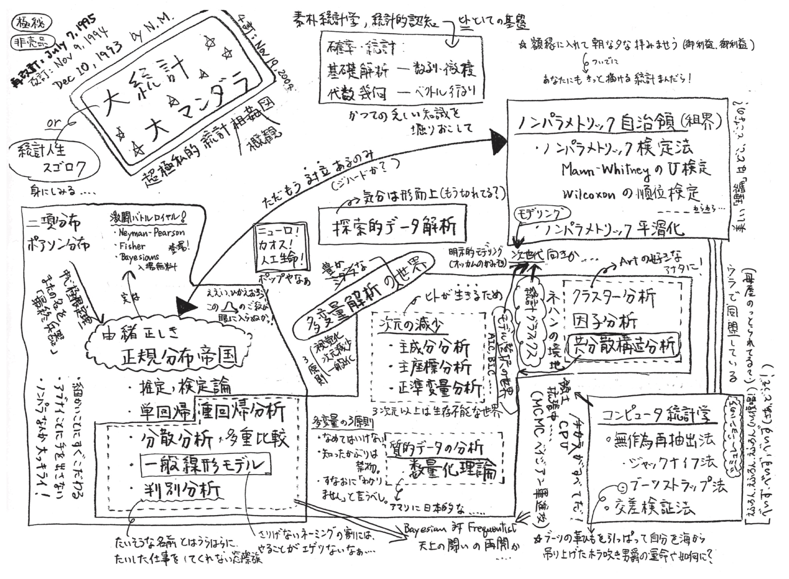
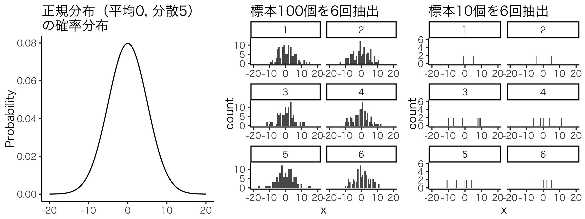
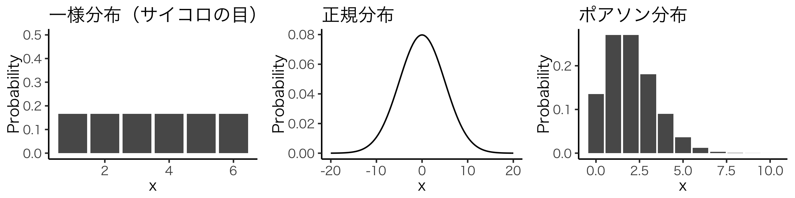
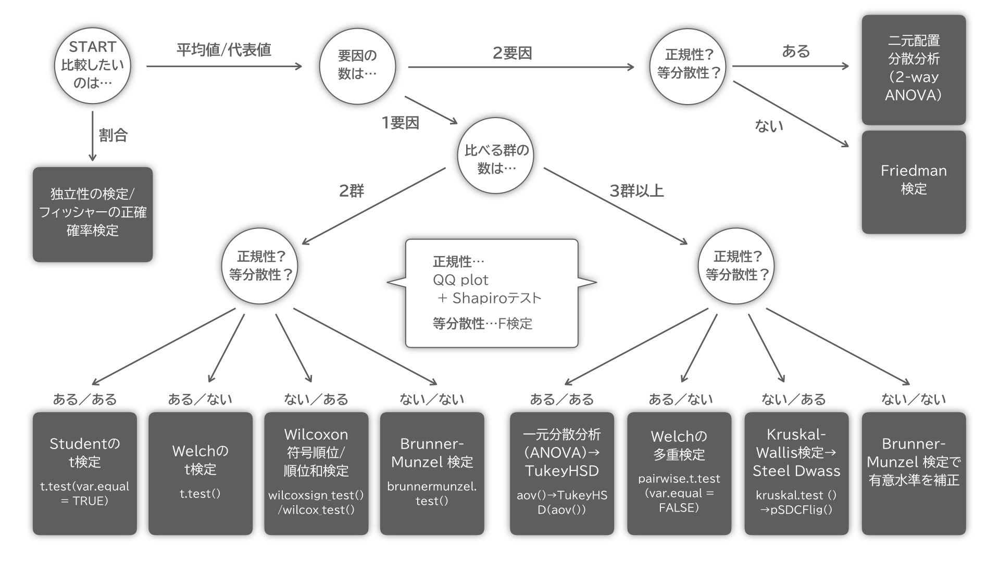
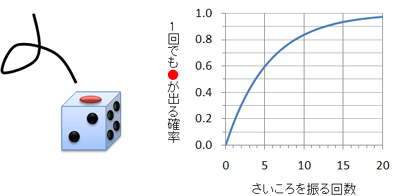

```{r setup, include=FALSE}
knitr::opts_chunk$set(echo = FALSE)
```


<style>
.column-left{
  float: left;
  width: 50%;
  text-align: left;
}
.column-right{
  float: right;
  width: 50%;
  text-align: left;
}
</style>


## 統計解析をしよう！

### 1. 課題を見つける／仮説を立てる  
### 2. 実験や観察をしてデータを集める  
### 3. **データを整理する** 
### 4. <span style="color: darkred;"> **データを解析して仮説を検証する**</span>  
<br>  

- 仮説の検証にはエビデンスが必要
- でも生物の表現型には<span style="color: darkred;"> ばらつき</span>がある
- 実験や観察で得られた差や効果は偶然の産物じゃないの？
    - これに答えるのが統計解析
    - 推論や予測などにも使うよ


## 広くて深い統計解析の世界{.smaller}
- *データの荒海を泳ぎ切ってもどこにも 「究極の真実」 などありはしないのだ。*  
- *統計学はその時その場かぎりでの 「最良の結論」 を導く便法にすぎないのだ。*  
{width=650px}<font size="2.5">[（三中信宏）](http://cse.naro.affrc.go.jp/minaka/R/R-top.html) </font>

    
## この実習で扱うのは...
### 実験生物学でよく使う基本的な統計解析
- 基礎知識と心構え
- 選び方
- 実践

### Rのみ（課金なし）でできる統計解析
- さまざまな統計解析用パッケージ
- より発展的な解析の足がかりへ

### この実習で扱わないこと
- 理論背景や難しい計算
- 発展的な解析（ベイズ統計とか）


## 母集団と標本  
### **統計解析...標本に基づいて、母集団の性質を推定する**  
{width=720px}

- **母集団**の性質を知りたいが実測は不可能
- そこでランダムに抽出した標本から母集団の性質を**推定**する
    - 実験で得られた値など（ランダムでなければ意味がない）
- 集団には**ばらつき**があるので毎回異なる値が得られる
- →ばらつきを考慮して母集団の性質を推定する


## 何か（Y）を何か（X）で説明したい
- **応答変数**（Y）（または目的変数, 従属変数）...調べたい値
- **説明変数**（X）（または独立変数）...Yのばらつきを説明する値

```{r, echo = FALSE, include=5, message = FALSE, warning = FALSE, fig.width=7, fig.height=3.5}
library(tidyverse)
library(palmerpenguins)
gp = ggplot(data = penguins) +
  geom_point(aes(x = body_mass_g, y = bill_length_mm, color = species)) +
  facet_wrap(~species) +
  labs(x = "X (Bill length)", y = "Y (Body mass)")
gp
```


## 扱う変数はさまざま
- **質的変数**
    - 名義尺度（電話番号、背番号、バスの系統番号など）
        - 順序もないし加減などの演算もできない
    - 順序尺度（レベルわけ、レースの着順など）
        - 順序による比較ができるが加減などの演算はできない
- **量的変数**
    - 間隔尺度（日付、摂氏温度や華氏温度など）
        - 目盛が等間隔で間隔に意味がある
        - 加減の演算にも意味がある
    - 比例尺度（質量、長さ、エネルギー、絶対温度など）
        - 間隔と比率に意味がある
        - 比にも、乗除の演算にも意味がある


## 統計解析法の選び方（1/4）
### **応答変数（Y）**も**説明変数（X）**も**量的**な場合...
```{r, echo = FALSE, include=5, fig.height=2.5, fig.width=6.5, warning = FALSE, message = FALSE}
penguins %>% ggplot(aes(x = bill_length_mm, y = bill_depth_mm, color = species), alpha = 0.5) +
  geom_point() +
  geom_smooth(method = glm, method.args = list(family = gaussian)) +
  theme_light() +
  labs(x = "Bill length (mm)", y = "Bill depth (mm)")
```

- <span style="color: darkred;">**統計モデリング（重回帰分析）**</span>
    - <span style="color: darkred;">一般化線形モデル（直線回帰／ポアソン回帰など）</span>
    - ベイズ統計モデル...さらに進んだ人に
- （相関分析）...素朴すぎて限界がある


## 統計解析法の選び方（2/4）
### **応答変数（Y）**は**量的**、**説明変数（X）**は**質的**な場合...
```{r, echo = FALSE, include=5, fig.height=2.5, fig.width=5, warning = FALSE, message = FALSE}
penguins %>% filter(!is.na(sex)) %>%
  ggplot(aes(x = sex, y = bill_depth_mm), alpha = 0.5) +
  geom_boxplot(aes(fill = species)) +
  geom_point(alpha = 0.5, position = position_jitter(width = 0.1), size = 1) +
  labs(x = "Sex", y = "Bill length (mm)") +
  facet_wrap(~ species) + 
  theme_light() +
  theme(legend.position = 'none')
```

- <span style="color: darkred;">**統計的仮説検定**</span>（分散分析）
   - ２群（<span style="color: darkred;">t検定, Wilcoxon検定, Brunner-Munzel検定</span>）
   - 多群（<span style="color: darkred;">ANOVA, Kruscal-Wallis検定</span>）
- <span style="color: darkred;">統計モデリングでもできる！</span>量的と質的が混じる場合はこっち
    - 一般化線形モデル（説明変数をダミー変数として扱う）


## 統計解析法の選び方（3/4）
### **応答変数（Y）**は**質的**、**説明変数（X）**は**量的**な場合...
- 割合データは質的変数を変形したもの
```{r, echo = FALSE, include=5, fig.height=2.5, fig.width=6.5, warning = FALSE, message = FALSE}
read_csv("https://kuboweb.github.io/-kubo/stat/iwanamibook/fig/binomial/data4a.csv") %>%
  rename(observed_seed = N, survived_seed = y, plant_size = x, treatment = f) %>%
  mutate(dead_seed = observed_seed-survived_seed) %>%
  ggplot(aes(x = plant_size , y = survived_seed/observed_seed, color = treatment)) +
  geom_point() +
  geom_smooth(method = glm, method.args = list(family = binomial)) +
  labs(x = "Plant size", y = "Survived ratio") +
  theme_light()
```

- <span style="color: darkred;">**統計モデリング（重回帰分析）**</span>
    - <span style="color: darkred;">一般化線形モデル（ロジスティック回帰）</span>
        - 応答変数のカテゴリ数が２個のみ（３以上は難しい）

 
## 統計解析法の選び方（4/4）
### **応答変数（Y）**も**説明変数（X）**も**質的**な場合...
```{r, echo = FALSE, include=5, fig.height=2.5, fig.width=6.5, warning = FALSE, message = FALSE}
penguins %>% 
  group_by(species, sex) %>%           
  summarise(length = length(species),  
            .groups     = "drop") %>%  
  filter(!is.na(sex)) %>%             
　ggplot(aes(x = species, y = length)) +
  geom_bar(aes(fill = sex), stat = "identity", position = "fill") +
  scale_y_continuous(labels = scales::percent) +
  coord_flip() +
  labs(x = "Species", y = "Sex") +
  theme_light()
```

- <span style="color: darkred;">**割合の検定**</span>（独立性の検定）
    - <span style="color: darkred;">χ（カイ）二乗検定</span>
    - フィッシャーの正確確率検定


## 仮説検定とモデリングは世界観が異なる
<div class="column-left">
### **統計的仮説検定**
- 各標本群が異なる母集団から得られたかを調べる
- （= 差があるかを検定する）

```{r, echo = FALSE, include=5, message = FALSE, warning = FALSE, fig.width=3.8, fig.height=3}
library(tidyverse)
library(palmerpenguins)
penguins %>% 
filter(species == "Adelie") %>%
filter(!is.na(sex)) %>%
ggplot(aes(x = body_mass_g, fill = sex)) +
geom_histogram(aes(y=..density..), position = "identity", alpha = 0.8) +
geom_density(position = "identity", alpha = 0.5) +
labs(x = "Body weight (g)", y = "Density") +
theme_light() +
theme(legend.position = "top")
```
</div>
<div class="column-right">
### **統計モデリング**
- 応答変数（Y）を説明変数（X）の式にあてはめる
- （= 関係性を説明する）
<br>

```{r, echo = FALSE, include=5, message = FALSE, warning = FALSE, fig.width=3.8, fig.height=3}
penguins %>% ggplot(aes(x = bill_length_mm, y = bill_depth_mm, color = species), alpha = 0.5) +
geom_point() +
geom_smooth(method = glm, method.args = list(family = gaussian)) +
theme_light() +
labs(x = "Bill length (mm)", y = "Bill depth (mm)") +
theme(legend.position = "top")
```
</div>


## 統計的仮説検定を使う場面とは
- 例えばこんなとき…
- とある卒研生が「**栄養豊富な餌で育ったハエは身体が大きくなる**」ことを主張しようとしてデータを集めた。
- これまでのデータによると、**通常の餌**で育てたハエの体長は**平均3.0mm**, 標準偏差1.0mmの正規分布に従う。
- 卒研生が**栄養豊富な餌**で育てたハエ10匹の体長は、**3.0, 3.0, 3.2, 3.4, 3.6, 4.0, 4.2, 4.2, 4.3, 4.5 mm**であった。
- この結果から、卒研生は栄養豊富な餌で育ったハエは**身体が大きくなる**と結論づけた。 
- ところが教授はこれに対して**「たまたま大きいハエがとれちゃったんじゃないの？」**とコメントした。
- さて、この教授にどのように反論したらよいだろうか？


## 統計的仮説検定の考え方
### **「こんなことがたまたま起こる確率はすごく低いです！」**
- 母集団からこのような標本が得られる可能性が低いことを示す
<br>

### **帰無仮説**（通常餌の母集団からこの標本が偶然得られた）
### **対立仮説**（偶然ではない＝異なる母集団から得られた）

※帰無仮説と対立仮説は排他的

1. 帰無仮説のもとで今回得られた標本が偶然生じる確率（**$p$値, $p$-value**）を計算する
2. $p$値が有意水準（$\alpha$）より低い場合、帰無仮説を棄却する
    - 伝統的に$p$ < 0.05で棄却（偶然起こるのは1/20回以下）
3. その結果、対立仮説を採択する（=「有意差がある」）


## $p$値をどのように求めるか（1/2）  
### $p$値は**検定統計量**に基づいて求める
- 検定統計量とは...
    - 仮説検定で用いられる統計量
    - （めっちゃざっくり言うと、とある前提に基づいて標本の性質をまとめた**仮説検定の基準になる値**）
    - 標本から計算された値を「検定統計量の実現値」と呼ぶ
    - **データに適した検定統計量**を使う必要がある
        - $Z$統計量、$t$統計量、$F$統計量、カイ二乗統計量など
- 帰無仮説のもとでの検定統計量の**確率分布**を元に、「**検定統計量の実現値が偶然得られる確率（=$p$値）**」を計算する
- $p$値が有意水準（$\alpha=0.05$）より低ければ帰無仮説を棄却する


## 確率分布って何？ 
- **確率分布**とは...ある確率変数がどんな確率でどんな値をとるかを表した分布（Xが値でYが確率）
- **確率変数**とは...実際に結果が得られるまでどんな値が得られるかが決まっていない変数
    - 同じ手続きでデータを得ても異なる値が得られるもの = 多くの実験／観測データはこれに当てはまる
- 確率の総和は１となる
- さまざまな典型的な確率分布が知られる

{width=800px}


## $p$値をどのように求めるか（2/2）  
1. 母集団に関する**帰無仮説と対立仮説**を設定する
2. **検定統計量（=検定方法）を選ぶ**
    - 検定の目的と標本の性質によって変わる
        - $Z$統計量、$t$統計量、$F$統計量、カイ二乗統計量など
3. 有意水準$\alpha$を決める（伝統的には$\alpha = 0.05$）
4. 標本から検定統計量の**実現値を求める**
5. 帰無仮説のもとでの検定統計量の確率分布と、検定統計量の実現値を比較し、「**帰無仮説のもとで得られた検定統計量の実現値が偶然得られる確率（=$p$値）**」を計算する  
6. $p$値が有意水準より低ければ帰無仮説を棄却する
<br>
- 4-6はRが自動的にやってくれます


## 簡単な例で見てみよう（1/2）
- とある卒研生（p.6）の例だと...母集団は正規分布に従い、平均（=3.0）と 標準偏差（=1.0）がわかっている
- 平均と標準偏差が既知の正規分布の場合、**$Z$統計量**が使える
    - $Z = \frac{\bar{X} - \mu}{\sqrt{\sigma^2/n}}$...平均値の差を標準誤差${\sqrt{\sigma^2/n}}$で標準化
        - $\bar{X}$...標本の平均 = 3.74
        - $\mu$...母集団の平均 = 3.0
        - $\sigma$...母集団の標準偏差 = 1.0
        - $n$...サンプルサイズ = 10
- 帰無仮説のもとでは**$Z$は標準正規分布（平均0, 標準偏差１の正規分布）に従う**
- 今回の場合、$Z = \frac{3.74 - 3}{\sqrt{1^2/10}}$ = 2.340085


## 簡単な例で見てみよう（2/2）
- 帰無仮説のもとで$Z$が従う標準正規分布では、$Z$が灰色の範囲（-1.96 < $Z$ < 1.96）外の値をとる確率は5%（=有意水準$\alpha$）

```{r, echo = FALSE, message = FALSE, fig.height=2.2, warning=FALSE}
library(tidyverse)
limitRange <- function(fun, min, max) {
  function(x) {
    y <- fun(x)
    y[x < min  |  x > max] <- NA
    return(y)
  }
}
p <- ggplot(data.frame(x=c(-4, 4)), aes(x=x))
p + stat_function(fun = dnorm) +
  stat_function(fun = limitRange(dnorm, -1.96, 1.96),geom="area", fill="black", alpha = 0.2) +
  annotate("text", x = c(-2.1, 2.1), y = 0.11, label = c(-1.96, 1.96), size = 5) +
  annotate("text", x = 0, y = 0.2, label = "95%", size = 8, color = "white") +
  theme_classic() +
  labs(y = "Probability", x = "Z") 
```

- 今回の場合、$Z=2.340085$ ←範囲外！
- 帰無仮説のもとで$Z=2.340085$になる確率（=$p$値）は0.01927935 
- → 有意水準$\alpha=0.05$より低い
- → 帰無仮説を棄却し、対立仮説を採用する


## さまざまな検定統計量
### **標本の性質や検定の目的によって使う検定統計量は異なる**
- **$Z$統計量**：$\frac{\bar{X} - \mu}{\sqrt{\sigma^2/n}}$...平均値の差を標準誤差${\sqrt{\sigma^2/n}}$で標準化
    - 母集団が平均と分散が既知の正規分布であるとき
    - 帰無仮説のもとでは$Z$は標準正規分布に従う
- **$t$統計量**：$\frac{\bar{X} - \mu}{\sqrt{\hat{\sigma}^2/n}}$...母分散$\sigma^2$の代わりに不偏分散$\hat{\sigma}^2$を使う
    - 母集団が平均が既知、分散が未知の正規分布であるとき
    - 帰無仮説のもとでは$t$は自由度$df = n-1$の$t$分布に従う
- 他にも**$F$統計量**や**カイ二乗統計量**など
<br>

- **不適切な統計量（=方法）を用いると誤った$p$値が得られる**


## 正しい解析法を使わないと意味がない 
### 統計解析法にはそれぞれ**守るべき前提条件**がある  
- 正しい$p$値を求めるために必要
- 標本の性質や解析の目的にあった方法を使わないと間違った$p$値が得られてしまう

### 有意差を求めて**間違った解析法を使うのは不正／不誠実**
- 間違った方法によって得られた$p < 0.05$に意味はない

### **自分のデータに合った解析**を選べるようになろう！
- より良い実験方法を模索するのと一緒で、より良い解析法を常に検討していく姿勢が大切！


## 仮説検定のよくある間違い
### **$p$>0.05 →「差がない」と結論するのは間違い**
- $p$>0.05 → 帰無仮説が棄却できない ≠ 差がない
- 統計的仮説検定の立場からは「どちらとも言えない」
- 態度を保留するのが正解

### **$p$値が小さい →「差が大きい」と結論するのも間違い**
- $p$値はサンプルサイズが大きいと有意になりやすい
- $p$値が小さいからといって差が大きいとは限らない
- 差の大きさを示すには効果量（effect size）  
    - [easystatsパッケージ群](https://github.com/easystats/easystats)が便利かも（[日本語解説](https://qiita.com/ocean_f/items/88cb805e994dab76a84c)）


## まずは統計的仮説検定をしてみよう！
### **守るべき前提条件**によって方法は変わる
{width=800px}


## 統計的仮説検定をしてみよう！
### [penguins](https://allisonhorst.github.io/palmerpenguins/)で練習しよう
{width=620px}


## 統計的仮説検定をしてみよう！
### 【復習】データを読み込んでざっくり眺める
```{r, echo = TRUE, message = FALSE}
library(palmerpenguins)               #penguinsを読み込み
library(tidyverse)                    #tidyverseを読み込み
head(penguins)                        #penguinsの最初を見せて！
```

- アデリーペンギンの体重に性差があるか？


## 統計的仮説検定をしてみよう！
### アデリーペンギンの体重に性差があるか？
### [練習問題]
- まずはデータをプロットしよう
    - 元データはpenguins
    - dplyrのfilterでspecies == "Adelie"だけ抽出
    - ggplot2でプロット
        - X軸...sex
        - Y軸...body_mass_g


## 統計的仮説検定をしてみよう！
### アデリーペンギンの体重に性差があるか？
```{r, echo = TRUE, message = FALSE}
penguins_adelie = penguins %>%
  filter(species == "Adelie")
head(penguins_adelie)
```


## 統計的仮説検定をしてみよう！
### アデリーペンギンの体重に性差があるか？
```{r, echo = TRUE, fig.height=2, fig.width=5}
gp = ggplot(data = penguins_adelie) +
  geom_point(aes(x = sex, y = body_mass_g), 
             position = position_jitter(width = 0.05))
gp
```

- オスのほうが大きそう…！でもNAとかあるなぁ…


## 統計的仮説検定をしてみよう！
### アデリーペンギンの体重に性差があるか？
```{r, echo = TRUE, message = FALSE}
penguins_adelie = penguins %>%
  filter(species == "Adelie", !is.na(sex)) #NAを除く
head(penguins_adelie)
```


## 統計的仮説検定をしてみよう！
### アデリーペンギンの体重に性差があるか？
```{r, echo = TRUE, fig.height=2.5, fig.width=5}
gp = ggplot(data = penguins_adelie) +
  geom_point(aes(x = sex, y = body_mass_g), 
             position = position_jitter(width = 0.05))
gp
```

- いい感じ！さて…


## 統計的仮説検定をしてみよう！
### データの**正規性**と**等分散性**によって使える方法は変わる
{width=800px}


## 正規性：標本が正規分布に従うかどうか
```{r, echo = FALSE, message = FALSE, fig.height=2, warning=FALSE}
gp1 = ggplot() +
    xlim(-20, 20) + 
    geom_function(fun = dnorm, args = list(mean = 0, sd = 5)) +
    theme_classic() +
    labs(y = "Probability")
gp1
```

### **正規分布**とは
- 左右対象の釣鐘型の分布
- 現実世界でしばしば見られる
    - ある一つの数値を目標とした作業で生じる偶然的な誤差
    - 性別と年齢を固定したときの身長の分布平均と分散
- 平均と分散（または標準偏差）がわかればどのような分布になるか一意に決まる（めちゃ便利）

## 等分散性：分散の程度が違うかどうか
```{r, echo = FALSE, message = FALSE, fig.height=4, warning=FALSE}
gp1 = ggplot(data = penguins_adelie) +
  geom_histogram(aes(x = body_mass_g, fill = sex)) +
  theme_classic() +
  facet_grid(sex ~ .) +
  labs(x = "Body mass (g)", y = "count")
gp1
```

- この場合、オスのほうがメスより分散が大きい
- 実際はFテストやBartlettテストの結果で判断する


## 統計的仮説検定をしてみよう！
### 統計的仮説検定の進め方
1. データをプロットして眺める
2. 各標本に正規性があるか調べる
    - <span style="color: darkred;">Q-Q plot</span>
    - <span style="color: darkred;">Shapiro-Wilkテスト</span>
3. 等分散性はあるか調べる
    - <span style="color: darkred;">Fテスト</span>
4. 2, 3の結果を受けて検定方法を決め、検定する


## 統計的仮説検定をしてみよう！
### 1. 各標本に正規性があるか（**Q-Q plot**）
```{r, echo = TRUE, fig.height=2}
gp = ggplot(data = penguins_adelie) +
       stat_qq(aes(sample = body_mass_g, color = sex)) + 
       facet_wrap( ~ sex, scales = "free")
gp
```

- 正規Q-Q plotで直線上に乗っているような気がする


## 統計的仮説検定をしてみよう！
### 1. 各標本に正規性があるか
- <span style="color: darkred;">**Shapiro-Wilkテスト**</span>
    - shapiro.test(【調べたい標本】) 
        - 【調べたい標本】はベクトルc(a, b, c...)で入れる
        - 【data.frame】$【列名】でも指定できる
    - 帰無仮説：正規性がある
    - p<0.05で正規性がないことを示す
    - （正規性があることは言えない）
    - １標本の値を入れる（**２標本を混ぜない**）
        - 平均の異なる正規分布を２つ混ぜたら正規分布ではなくなる


## 統計的仮説検定をしてみよう！
### 1. 各標本に正規性があるか（Shapiro-Wilkテスト）
```{r, echo = TRUE, include=5}
sw_test_results = penguins_adelie %>%   #penguins_adelieを使う
  group_by(sex) %>%                     #sexでグループ
  summarise(statistic = shapiro.test(body_mass_g)$statistic, 
        #body_mass_gにshapiro.testを行い、そのstatistic値をstatisticという列に
            p.value = shapiro.test(body_mass_g)$p.value,    #同様
            .groups     = "drop") #グループを解除
head(sw_test_results)
```

- 正規性がないとは言えない→「正規性あり」と判断

## 統計的仮説検定をしてみよう！
### 2. 等分散性があるか
- <span style="color: darkred;">**Fテスト**</span>
    - ベクトルとして
        - var.test(【標本A】, 【標本B】) 
            - 標本はベクトルc(a, b, c...)で入れる
    - データフレームとして
        - var.test(data = 【data.frame】, 【調べたい値の列名】~ 【グループ分けの列名】)
    - 帰無仮説：等分散性がある
    - p<0.05で等分散性がないことを示す
          

## 統計的仮説検定をしてみよう！
### 2. 等分散性があるか（Fテスト）
```{r, echo = TRUE, include=5}
var.test(data = penguins_adelie, body_mass_g ~ sex)
```

- p<0.05なので「等分散性なし」と判断


## 正規性のある２群の比較
### アデリーペンギンの体重に性差があるか？
- 正規性はあり
- 等分散性はなし
- 普通のt検定（正規性と等分散性が前提条件）は使えない
- → Welchのt検定（正規性のみが前提条件）を使う  
    - [フローチャートを参照](R_training_2021_6.html#16)


## 正規性のある２群の比較
### 正規性あり等分散なしの２群の検定  
- <span style="color: darkred;"> **Welchのt検定**</span>  
    - ベクトルとして
        - t.test(【標本A】, 【標本B】)  
    - データフレームとして
        - t.test(data = 【data.frame】, 【調べたい値の列名】~ 【グループ分けの列名】)  
    - 帰無仮説：平均が等しい  
    - p<0.05で平均が異なる母集団に由来することを示す  
     


## 正規性のある２群の比較
### アデリーペンギンの体重に性差があるか？(Welchのt検定)
```{r, echo = TRUE, include=5}
t.test(data = penguins_adelie, body_mass_g ~ sex)
```
- 帰無仮説「平均が等しい」は棄却→有意差あり


## 正規性のある２群の比較{.smaller}
### アデリーペンギンの体重に性差があるか？(Welchのt検定)
```{r, echo = TRUE, include=5, fig.height=2.5, fig.width=5}
gp = ggplot(data = penguins_adelie) +
  geom_point(aes(x = sex, y = body_mass_g), size = 0.8,
             position = position_jitter(width = 0.07), alpha = 0.5) +
  annotate("text", x = 1.5, y = 5200, label = "***", size = 5, color = "gray30") +
  annotate("segment", x = 1.2, xend = 1.8, y = 5000, yend = 5000, color = "gray30") +
  coord_cartesian(ylim = c(0, 6000))
gp
```
<font size="4.5">ようやくグラフが完成！</font>


## 統計解析の結果を出力する
- [easystats](https://github.com/easystats/easystats)パッケージを使う
    - パッケージをインストールしてから...
    - report(【統計解析】)
        - このままだと文章型で出力される
    - 後ろに%>% as.data.frameとすると表型になる
    - さらに後ろに%>% write_csvで書き出せる


## 統計解析の結果を出力する{.smaller}
### 文章として出力する（効果量も教えてくれる）
- ※１行目の#を消してインストール
```{r, echo = TRUE, include=5, fig.height=2.5, fig.width=5, message=FALSE}
#install.packages("easystats", repos = "https://easystats.r-universe.dev")
library("easystats")
report(t.test(data = penguins_adelie, body_mass_g ~ sex)) 
```

### CSVとして書き出す（フォルダにCSVができるはず）
```{r, echo = TRUE, include=5, fig.height=2.5, fig.width=5, message=FALSE}
report(t.test(data = penguins_adelie, body_mass_g ~ sex)) %>%
  as.data.frame %>%                        #データフレームの形にして
  write_csv(file = "result_ttest.csv") %>% #csvに書き出し
  print()                                  #表示
```


## 正規性のある２群の比較
### var.equal = の設定で等分散性ありの検定に変えられる  
<br>

### 等分散性なし→**Welchのt検定**
- t.test(data, Y ~ X, var.equal = <span style="color: darkred;">FALSE</span>)...デフォルト
    - 何も設定しなかったらこっち

### 等分散性あり→**Studentのt検定**
- t.test(data, Y ~ X, var.equal = <span style="color: darkred;">TRUE</span>)

<br>

#### 等分散性がわからない時点で、F検定をせずにWelchのt検定をすべきという考え方がメジャーになりつつある


## 正規性のある２群の比較
### paired = の設定で対応ありの検定に変えられる
### 対応なし
- t.test(data, Y ~ X, paired = <span style="color: darkred;">FALSE</span>)...デフォルト

### 対応あり
- t.test(data, Y ~ X, paired = <span style="color: darkred;">TRUE</span>)
    - 同じ個体から複数回とったデータを比較したいとき
    
```{r, echo = FALSE, fig.height=2, fig.width=6}
library(cowplot)
a = rep(c("Before", "After"), times = c(4, 4))
b = seq(1:8)
c = rep(c("c", "d", "e", "f"), 2)
d = rep(c("Group A", "Group B"), times = c(4, 4))
data = data.frame(X = a, Y = b, Z = c, W = d) %>%
  mutate(X = fct_relevel(X, rev))
gp1 = ggplot(data = data, aes(x = W, y = Y, group = Z)) +
  geom_point(size = 2) + 
  coord_cartesian(ylim = c(0, 10)) +
  theme_classic() +
  theme (axis.title.x = element_blank())
gp2 = ggplot(data = data, aes(x = X, y = Y, group = Z)) +
  geom_point(size = 2) + 
  geom_line(linetype="dashed") + 
  coord_cartesian(ylim = c(0, 10)) +
  theme_classic() +
  theme (axis.title.x = element_blank())
gp = plot_grid(gp1, NULL, gp2,
               nrow = 1,
               ncol = 3,
               label_size = 20,
               rel_widths = c(1, 0.02, 1))
gp
```


## 正規性のある２群の比較
### ［練習問題］
- 対応なし、等分散性ありの検定をしてみよう
- 対応あり、等分散性なしの検定をしてみよう


## 正規性のある２群の比較
### ［練習問題］
- 対応なし、等分散性ありの検定をしてみよう
```{r, echo = TRUE, include=5}
t.test(data = penguins_adelie, body_mass_g ~ sex, 
       paired = FALSE, var.equal = TRUE) # paired = FALSEは省略可能

```


## 正規性のある２群の比較
### ［練習問題］
- 対応あり、等分散性なしの検定をしてみよう
```{r, echo = TRUE, include=5}
t.test(data = penguins_adelie, body_mass_g ~ sex, 
       paired = TRUE, var.equal = FALSE) # var.equal = FALSEは省略可能
```


## 正規性のない２群の比較
### くちばしの形は雌雄で異なるか？
{width=400px}

- 細長さは(bill_length_mm)÷(bill_depth_mm)で指標が作れそう
- こういう割り算データは正規性がないと思ったほうがいい
- （平均値や中央値が0や1に近いときの分布を考えてみよう）


## 正規性のない２群の比較
### くちばしの細長さは雌雄で異なるか？
### [練習問題]
- アデリーペンギンのくちばしの細長さを計算しよう
- 計算できたらプロットしてみよう


## 正規性のない２群の比較
### くちばしの細長さは雌雄で異なるか？
### [練習問題]
```{r, echo = TRUE}
penguins_adelie = penguins %>%
  filter(species == "Adelie", !is.na(sex)) %>% #NAを除く
  mutate(ratio = bill_depth_mm/bill_length_mm)
head(penguins_adelie)
```


## 正規性のない２群の比較
### くちばしの細長さは雌雄で異なるか？
### [練習問題]
```{r, echo = TRUE, fig.height=2.5}
gp = ggplot(data = penguins_adelie) +
  geom_point(aes(x = sex, y = ratio), 
             position = position_jitter(width = 0.05))
gp
```


## 正規性のない２群の比較
### くちばしの細長さは雌雄で異なるか？
### 1. 各標本に正規性はあるか（**Q-Q plot**）
```{r, echo = TRUE, fig.height=2.5}
gp = ggplot(data = penguins_adelie) +
       stat_qq(aes(sample = ratio, color = sex)) + 
       facet_wrap( ~ sex, scales = "free")
gp
```


## 正規性のない２群の比較
### くちばしの細長さは雌雄で異なるか？
### 1. 各標本に正規性はあるか（Shapiro-Wilkテスト）
```{r, echo = TRUE, include=5}
sw_test_results = penguins_adelie %>%   #penguins_adelieを使う
  group_by(sex) %>%                     #sexでグループ
  summarise(statistic = shapiro.test(ratio)$statistic, 
            p.value = shapiro.test(ratio)$p.value, 
            .groups     = "drop") 
head(sw_test_results)
```


## 正規性のない２群の比較
### くちばしの細長さは雌雄で異なるか？
### 2. 等分散性があるか（Fテスト）
```{r, echo = TRUE, include=5}
var.test(data = penguins_adelie, ratio ~ sex)
```


## 正規性のない２群の比較
### くちばしの細長さは雌雄で異なるか？
- 正規性はなし
- 等分散性はあり
- 対応はない
- → Wilcoxonの順位和検定（U検定と同じ）を行う
    - [フローチャートを参照](R_training_2021_6.html#16)

## 正規性のない２群の比較
### 正規性なし等分散性ありの２群の比較
- <span style="color: darkred;"> **Wilcoxonの順位和検定**</span>  
    - デフォルトのwilcox.test()ではタイ（同値）があった場合に正確なp値が出ないので[coin](https://cran.r-project.org/web/packages/exactRankTests/index.html)パッケージを使う
        - ベクトルとして
            - wilcox_test(【標本A】, 【標本B】, distribution = "exact")  
        - データフレームとして
            - wilcox_test(data = 【data.frame】, 【調べたい値の列名】~ 【グループ分けの列名】, distribution = "exact")  
    - 帰無仮説：２群間に差がない  
    - p<0.05で異なる母集団に由来することを示す  


## 正規性なし、等分散性ありの２群の比較
### くちばしの細長さは雌雄で異なるか？
まずインストールする（１行目の#を消して走らせる）
```{r, echo = TRUE, message = FALSE}
#install.packages("coin")
library(coin)             # 読み込み
wilcox_test(data = penguins_adelie, ratio ~ sex, distribution = "exact")
```
- 帰無仮説「２群間に差がない」は棄却されない→有意差なし


## 正規性なし、等分散性ありの２群の比較
### 対応なし→**Wilcoxonの順位和検定**
- wilcox_test(data, Y ~ X, distribution = "exact")

### 対応あり→**Wilcoxonの符号順位検定**
- wilcoxsign_test(data, Y ~ X, distribution = "exact")


## 正規性なし、等分散性なしの２群の比較
- <span style="color: darkred;"> **Brunner-Munzel検定**</span>  

{width=800px}

## 正規性なし、等分散性なしの２群の比較
- <span style="color: darkred;"> **Brunner-Munzel検定**</span>  
    - [brunnermunzel](https://cran.r-project.org/web/packages/brunnermunzel/index.html)パッケージを使う
    - ベクトルとして
        - brunnermunzel.test(【標本A】, 【標本B】)  
    - データフレームとして
        - brunnermunzel.test(data = 【data.frame】, 【調べたい値の列名】~ 【グループ分けの列名】)  
    - 帰無仮説：２群間に差がない 
    - p<0.05で異なる母集団に由来することを示す  
    - 「サンプル数が少ない」というエラーが出たらbrunnermunzel.permutation.test
     

## 正規性なし、等分散性なしの２群の比較
### さっきのデータで使ってみよう  
まずインストールする（１行目の#を消して走らせる）
```{r, echo = TRUE, message = FALSE}
#install.packages("brunnermunzel")
library(brunnermunzel)             # 読み込み
brunnermunzel.test(data = penguins_adelie, ratio ~ sex)
```


## 【まとめ】１要因２群間の検定法
1. まずはプロット
2. 正規性, 等分散性, 対応あり/なしを確認
    - Q-Q plot, Shapiro-Wilkテスト
    - F検定
3. 検定方法を決める
    - Studentのt検定（対応あり／なし）
    - Welchのt検定（対応あり／なし）
    - Wilcoxonの順位和検定
    - Wilcoxonの符号順位検定
    - Brunner-Munzel検定（対応あり／なし）


## 多群（３群以上）の比較をしよう
### **２群の比較を単に繰り返すのはダメ**
- 仮説検定の考え方を思い出そう
1. 同じ母集団由来であった場合に今回得られた標本の差が生じる確率が低い（<5%）→帰無仮説を棄却する
2. その結果、対立仮説を採用する

### **どこかで有意差が出る確率はどんどん高まる**  
- 100回検定すれば5回は偶然有意差が出る
<font size="3">[阪大医学・老年・腎臓内科学HP](https://www.med.osaka-u.ac.jp/pub/kid/clinicaljournalclub1.html)</font>


## 多群（３群以上）の比較をしよう
### 有意差があった群のみ検定したことにする？
### →もちろん**不正**！！
### 多重比較法を使うか、有意水準を補正する
- 今回は多重比較を紹介します
- 有意水準の補正の方法は[こちら](https://oku.edu.mie-u.ac.jp/~okumura/stat/multiplecomparisons.html)など


## 多群（３群以上）の比較をしよう
### 【復習】読み込んでデータをざっくり眺める
```{r, echo = TRUE, message = FALSE}
library(palmerpenguins)               #penguinsを読み込み
library(tidyverse)                    #tidyverseを読み込み
head(penguins)                        #penguinsの最初を見せて！
```

- ペンギンの体重は種ごとに異なるか？


## 多群（３群以上）の比較をしよう
### ペンギンの体重は種ごとに異なるか？
- 体重に性差があるのでメスに限定して調べよう
- まずはデータをプロットしよう
```{r, echo = TRUE, message = FALSE}
penguins_female = penguins %>%
  filter(sex == "female")
head(penguins_female)
```


## 多群（３群以上）の比較をしよう
### ペンギンの体重は種ごとに異なるか？
- まずはデータをプロットしよう
```{r, echo = TRUE, fig.height=2}
gp = ggplot(data = penguins_female) +
  geom_point(aes(x = species, y = body_mass_g), 
             position = position_jitter(width = 0.05))
gp
```

- 差がありそうな雰囲気…！


## 多群（３群以上）の比較をしよう
### ３群以上の比較を行うときも進め方は同じ
1. データをプロットして眺める
2. 各標本に正規性があるか調べる
    - <span style="color: darkred;">Q-Q plot</span>
    - <span style="color: darkred;">Shapiro-Wilkテスト</span>
3. 等分散性はあるか調べる
    - <span style="color: darkred;">Bartlettテスト</span> ←Fテストの多群版
4. 2, 3の結果を受けて検定方法を決め、検定する


## 多群（３群以上）の比較をしよう
### 1. 各標本に正規性はあるか（**Q-Q plot**）
```{r, echo = TRUE, fig.height=2.5}
gp = ggplot(data = penguins_female) +
  stat_qq(aes(sample = body_mass_g, color = species)) + 
  facet_wrap( ~ species, scales = "free")
gp
```

- 正規Q-Q plotで直線上に乗っているような気がする


## 多群（３群以上）の比較をしよう
### 1. 各標本に正規性はあるか（Shapiro-Wilkテスト）
```{r, echo = TRUE, include=5}
sw_test_results = penguins_female %>%   #penguins_adelieを使う
  group_by(species) %>%                     #speciesでグループ
  summarise(statistic = shapiro.test(body_mass_g)$statistic, 
        #body_mass_gにshapiro.testを行い、そのstatistic値をstatisticという列に
            p.value = shapiro.test(body_mass_g)$p.value,    #同様
            .groups     = "drop") #グループを解除
head(sw_test_results)
```

- 「正規性あり」と判断


## 多群（３群以上）の比較をしよう
### 2. 等分散性があるか
- <span style="color: darkred;">**Bartlettテスト**</span>
    - ベクトルとして
        - bartlett.test(x = list(A, B, C)) 
    - データフレームとして
        - bartlett.test(data = 【data.frame】, 【調べたい値の列名】~ 【グループ分けの列名】)
    - 帰無仮説：等分散性がある
    - p<0.05で等分散性がないことを示す


## 多群（３群以上）の比較をしよう
### 2. 等分散性があるか（Bartlettテスト）
```{r, echo = TRUE, include=5}
bartlett.test(data = penguins_female, body_mass_g ~ species)
```

- 「等分散性あり」と判断


## 多群（３群以上）の比較をしよう
### ペンギンの体重は種ごとに異なるか？
- 正規性あり
- 等分散性あり
- ３群以上
- → 一元分散分析（ANOVA）を使う  


## 多群（３群以上）の比較をしよう
### 正規性あり等分散性ありの多群比較
- <span style="color: darkred;"> **一元分散分析（ANOVA）**</span>  
    - summary(aov(data = 【data.frame】, 【調べたい値の列名】~ 【グループ分けの列名】))  
    - 帰無仮説：全ての群が同一の母集団に由来する（=全ての群に差がない）
    - p<0.05で異なる母集団に由来することを示す  


## 多群（３群以上）の比較をしよう
### ペンギンの体重は種ごとに異なるか？

```{r, echo = TRUE, include=5}
summary(aov(data = penguins_female, body_mass_g ~ species))
```

- 有意差はある
- 帰無仮説（群間に差がない）は棄却された
- どのペアに差があるのか？
    - post-hocテストを行う


## 多群（３群以上）の比較をしよう
### 正規性あり等分散性ありの多群比較のpost-hocテスト
- <span style="color: darkred;"> **Tukeyの多重比較**</span>  
    - TukeyHSD(aov(data = 【data.frame】, 【調べたい値の列名】~ 【グループ分けの列名】))  
    - 帰無仮説：２群間に差がない  
    - p<0.05で異なる母集団に由来することを示す  
    
    

## 多群（３群以上）の比較をしよう
### ペンギンの体重は種ごとに異なるか？
```{r, echo = TRUE, include=5}
TukeyHSD(aov(data = penguins_female, body_mass_g ~ species))
```


## 多群（３群以上）の比較をしよう
### ペンギンの体重は種ごとに異なるか？
```{r, echo = TRUE, fig.height=2, fig.width=5}
gp = ggplot(data = penguins) +
  geom_point(aes(x = species, y = body_mass_g), size = 0.5, 
             position = position_jitter(width = 0.05), alpha = 0.3) +
  annotate("text", x = c(1, 2, 3), y = 7000, label = c("a", "b", "c")) +
  coord_cartesian(ylim = c(0, 8000))
gp
```
<font size="4.5">できあがり！</font>


## 多群（３群以上）の比較をしよう
### 正規性なし、等分散性ありの場合は...
- <span style="color: darkred;"> **Kruscal-Wallis検定**</span>  
    - kruskal.test(data = 【data.frame】, 【調べたい値の列名】~ 【グループ分けの列名】)  
    - 帰無仮説：全ての群に差がない  
    - p<0.05で異なる母集団に由来することを示す  
    - ただし近似のp値を計算するのでサンプルサイズが小さい場合は注意
    
    
## 多群（３群以上）の比較をしよう
### post-hocは...
- <span style="color: darkred;"> **Steel-Dwass検定**</span>
    - [NSM3](https://cran.r-project.org/web/packages/NSM3/index.html)パッケージを使う
    - pSDCFlig(【調べたい値をベクトルで】, 【グループ分けをベクトルで】, method = 【方法】)  
        - methodは３種類
            - "Exact"...正確
            - "Asymptotic"... 漸近
            - "Monte Carlo"...モンテカルロ法
                - 正確以外の場合はサンプルサイズに注意
    - 帰無仮説：２群間に差がない  
    - p<0.05で異なる母集団に由来することを示す  


## 多群（３群以上）の比較をしよう
### ペンギンの体重は種ごとに異なるか？（Kruscal-Wallis）

```{r, echo = TRUE, include=5, message=FALSE}
kruskal.test(data = penguins_female, body_mass_g ~ species)
```


## 多群（３群以上）の比較をしよう{.smaller}
### ペンギンの体重は種ごとに異なるか？（Steel-Dwass）
まずインストールする（１行目の#を消して走らせる）
```{r, echo = TRUE, include=5, message=FALSE}
#install.packages("NSM3")
library(NSM3)
pSDCFlig(penguins_female$body_mass_g, penguins_female$species, method = "Asymptotic")
```


## 【まとめ】１要因多群間の検定法
1. まずはプロット
2. 正規性, 等分散性, 対応あり/なしを確認
    - Q-Q plot, Shapiro-Wilkテスト
    - Bartlettテスト
3. 検定方法を決める
    - ANOVA → Tukey
    - Kruscal-Wallis → Steel-Dwass
    - [フローチャートを参照](R_training_2021_6.html#16)

### ２要因の場合は…
- Two-way ANOVAやFriedman検定など


## 説明変数が量的 or 複数ならモデリング
### **統計モデリング**
- 応答変数（Y）を説明変数（X）の式にあてはめる
- （= 関係性を説明する）
- 実は質的変数にも普通に使え、ANOVA等と同等の解析も可能

```{r, echo = FALSE, include=5, message = FALSE, warning = FALSE, fig.width=6, fig.height=3}
penguins %>% ggplot(aes(x = bill_length_mm, y = bill_depth_mm, color = species), alpha = 0.5) +
geom_point() +
geom_smooth(method = glm, method.args = list(family = gaussian)) +
theme_light() +
labs(x = "Bill length (mm)", y = "Bill depth (mm)") 
```


## 一般化線形モデル（GLM）とは（1/2）
- Generalized linear model
- 残差<font size="5">（観察値と推定値の差）</font>を任意の確率分布とした線形モデル

```{r, echo = FALSE, include=5, fig.height=2.5, fig.width=8, warning = FALSE, message = FALSE}
library(tidyverse)
library(palmerpenguins)
library(cowplot)
gp1 = penguins %>% ggplot(aes(x = bill_length_mm, y = bill_depth_mm, color = species), alpha = 0.5) +
  geom_point() +
  geom_smooth(method = glm, method.args = list(family = gaussian)) +
  labs(title = "線形回帰（直線)") +
  theme_light(base_family = "HiraKakuPro-W3") +
  theme(legend.position = "none",
        axis.title = element_blank())

gp2= read_csv("https://kuboweb.github.io/-kubo/stat/iwanamibook/fig/poisson/data3a.csv") %>%
  rename(no.seed = y, plant_size = x, treatment = f) %>% 
  ggplot(aes(x =plant_size , y = no.seed, color = treatment)) +
  geom_point() +
  geom_smooth(method = glm, method.args = list(family = poisson)) +
    labs(title = "ポアソン回帰（指数）") +
  theme_light(base_family = "HiraKakuPro-W3") +
  theme(legend.position = "none",
        axis.title = element_blank())

gp3 = read_csv("https://kuboweb.github.io/-kubo/stat/iwanamibook/fig/binomial/data4a.csv") %>%
  rename(observed_seed = N, survived_seed = y, plant_size = x, treatment = f) %>%
  mutate(dead_seed = observed_seed-survived_seed) %>%
  ggplot(aes(x = plant_size , y = survived_seed/observed_seed, color = treatment)) +
  geom_point() +
  geom_smooth(method = glm, method.args = list(family = binomial)) +
  labs(title = "ロジスティック回帰") +
  theme_light(base_family = "HiraKakuPro-W3") +
  theme(legend.position = "none",
        axis.title = element_blank())

plot_grid(gp1, gp2, gp3, 
                nrow = 1,
                ncol = 3)
```

- 直線以外にも指数関数orシグモイド的な回帰などができる
- ただしあまりぐにゃぐにゃせず、Xが増えるに従ってYは増えるか減るかどちらか


## 一般化線形モデル（GLM）とは（2/2）
- 以下の３つの要素から成る
    - **リンク関数**...XとYが大体どんな関係かの回帰式
        - 例：直線、指数、シグモイド…
    - **線形予測子**...回帰式のパラメータ（Y ~ $\beta_0$ + $\beta_1$X)
    - **誤差構造**...応答変数の予測値の周りのばらつきの分布
    
```{r, echo = FALSE, include=5, message = FALSE, warning = FALSE, fig.width=5, fig.height=2.8}
library(tidyverse)
library(ggridges)

n = 300L
a = 3
b = -3
df_pois = tibble::tibble(x = runif(n, 0.4, 1.7), y = rpois(n, exp(a * x + b)))

x_breaks = c(0.5, 1.0, 1.5)
coeff = lm(y ~ x, data = df_pois)$coefficients
df_lm = tidyr::crossing(x = x_breaks, y = seq(-5, 20, 0.1)) %>%
  dplyr::mutate(density = dnorm(y, coeff[1] + coeff[2] * x, 1.4)) %>%
  dplyr::filter(density > 1e-4)

p_pois = ggplot(df_pois) + aes(x, y) +
  ggridges::geom_vridgeline(data = df_lm, aes(width = density * 0.4, group = x), linetype = 0, alpha = 0) +
  geom_point(alpha = 0.5, shape = 16, size = 2) +
  scale_x_continuous(breaks = x_breaks) +
  theme_bw(base_size = 20) +
  theme(panel.grid.minor = element_blank())
#p_pois + stat_smooth(formula = y ~ x, method = lm, se = FALSE)

p_lm = p_pois +
  stat_smooth(formula = y ~ x, method = lm, se = FALSE) +
  ggridges::geom_vridgeline(data = df_lm, aes(width = density * 0.4, group = x), fill = "#3366ffaa", linetype = 0)
# p_lm
df_ridges = tidyr::crossing(x = x_breaks, y = seq_len(30L) - 1L) %>%
  dplyr::mutate(density = dpois(y, exp(a * x + b))) %>%
  dplyr::filter(density > 1e-4)
df_bars = df_ridges %>% wtl::ridges2bars(y, density)
p_poisson = p_pois +
  stat_smooth(formula = y ~ x, method = glm, method.args = list(family = poisson), se = FALSE) +
  ggridges::geom_vridgeline(data = df_bars, aes(width = density * 0.5, group = x), fill = "#3366ffaa", linetype = 0) +
  coord_cartesian(ylim = c(-2, 12)) +
  labs(x = "X", y = "Y")
 p_poisson

```
&emsp;<div style="text-align: right;">
<font size="3">Coded by [Heavy Watal](https://heavywatal.github.io/slides/tokiomarine2021/2-stats-model.html) </font>
</div>


## GLMにはglm関数を使う（1/4）
### ３つの要素を設定するだけ
- glm(**【線形予測子】**, family = **【誤差構造】**(link = **【リンク関数】**), data = 【データフレーム】)
    - 例：glm(bill_length_mm ~ bill_depth_mm + species, family = gaussian(link = identity), data = penguins)


```{r, echo = FALSE, include=5, message = FALSE, warning = FALSE, fig.width=6, fig.height=3}
penguins %>% ggplot(aes(x = bill_depth_mm, y = bill_length_mm, color = species), alpha = 0.5) +
geom_point() +
geom_smooth(method = glm, method.args = list(family = gaussian)) +
theme_light() +
labs(x = "Bill length (mm)", y = "Bill depth (mm)") 
```


## GLMにはglm関数を使う（2/4）
### **【線形予測子】**...data.frameの**列名**を指定
- **単回帰**【応答変数】 ~ 【説明変数】
    - 例）bill_length_mm ~ bill_depth_mm
        - 嘴の長さ ~ $\beta_0$ + ($\beta_1$×嘴の幅)
- **重回帰（交互作用なし）**【応答】 ~ 【説明１】+【説明２】
    - 例）bill_length_mm ~ bill_depth_mm + species
        - 嘴の長さ ~ $\beta_0$ + ($\beta_1$×嘴の幅) + ($\beta_2$×種)
- **重回帰（交互作用あり）**【応答】 ~ 【説明１】*【説明２】
    - 解釈が難しい場合は避ける
    - 例）bill_length_mm ~ bill_depth_mm * species
        - 嘴の長さ ~ $\beta_0$ + ($\beta_1$×嘴の幅) + ($\beta_2$×種) + ($\beta_3$×嘴の幅と種の交互作用) 


## GLMにはglm関数を使う（3/4）
### **【誤差構造】**...下記から選び、（）内の分布名を設定
- **正規分布**（gaussian）...確率変数の和、平均値
    - $-∞\leqq Y < ∞$（下限なし, 上限なし）, 連続値
- **二項分布**（binomial）...成功率p、試行回数nのうちの成功回数
    - $0\leqq Y \leqq max$（下限あり, 上限あり）, 離散値
- **ポアソン分布**（poisson）...単位時間あたり平均λ回起こる事象の発生回数
    - $0\leqq Y \leqq ∞$, （下限あり, 上限なし）, 離散値
- **ガンマ分布**（Gamma）...ポアソン過程でk回起こるまでの待ち時間
    - $0\leqq Y \leqq ∞$, （下限あり, 上限なし）, 連続値
- 他にinverse.gaussian, quasi, quasibinomial, quasipoisson


## GLMにはglm関数を使う（4/4）
### **【リンク関数】**...下記から選び、（）内の関数名を設定
- **そのまま**（identity）...直線回帰
    - $Y = \beta_0 + \beta_1 X$
    - 誤差構造：正規分布
- **対数**（log）...指数回帰
    - $log(Y) = \beta_0 + \beta_1 X \therefore Y = e^{\beta_0 + \beta_1 X}$
    - 誤差構造：ポアソン分布など
- **ロジット**（logit）...ロジスティック回帰（シグモイド型）
    - $logit(Y) = \beta_0 + \beta_1 X \therefore Y = \frac{1}{1+e^-(\beta_0 + \beta_1 X)}$
    - 誤差構造：二項分布
- 他にprobit, cloglog, sqrt, 1/mu^2, inverseが使える


## GLMを実践してみよう！
### penguinsデータで練習しよう
```{r, echo = TRUE, message = FALSE}
library(palmerpenguins)               #penguinsを読み込み
library(tidyverse)                    #tidyverseを読み込み
head(penguins)                        #penguinsの最初を見せて！
```

- 体重の大きいペンギンは翼長も長い？


## GLMを実践してみよう！
### 体重の大きいアデリーは翼長も長い？（まずはプロット）
```{r, echo = TRUE, fig.height=2.4, fig.width=5, warning=FALSE}
gp = ggplot(data = penguins_adelie) +
  geom_point(aes(x = body_mass_g, y = flipper_length_mm)) 
gp
```

- 体重が大きければ翼長も長いような気がする
- 上昇は直線的な感じだし、翼長は正規分布でよさそう


## GLMを実践してみよう！{.smaller}
### 体重の大きいアデリーは翼長も長い？（GLM）
```{r, echo = TRUE, fig.height=2, fig.width=5, warning=FALSE}
glm_result = glm(flipper_length_mm ~ body_mass_g,        #線形予測子
                 family = gaussian(link = "identity"),   #誤差分布とリンク関数
                 data = penguins_adelie)                 #データ
summary(glm_result)                  #結果を格納したglm_resultの詳細を表示する
```


## GLMを実践してみよう！
### **結果の見方**
- Coefficients: 回帰係数
    - Estimates: 推定値
    - Pr(>|t|): 帰無仮説（切片や係数が0である）に対するp値。
        - (Intercept)：切片$\beta_0$
        - body_mass_g：body_mass_gの係数$\beta_1$

### 今回の結果は…
- $\beta_0$: 1.652e+02 = 165.2 (Pr(>|t|)< 2e-16)
- $\beta_1$: 6.677e-03 = 0.006677 (Pr(>|t|)=3.4e-09)
- →翼長への体サイズの効果は有意である
- →$Y = 0.006677X + 165.2$に回帰できる


## GLMを実践してみよう！{.smaller}
### ggplotのgeom_smoothでプロットにglmを重ねられる
- これはglm関数で得られた回帰（=glm_result）ではなく、ggplot2関数で得られた回帰であることに注意（glm関数とggplot2の設定は自分で一致させないとダメ）
- glm関数での値を直接plotしたければ[ggeffects](https://cran.r-project.org/web/packages/ggeffects/vignettes/ggeffects.html)パッケージ（[日本語解説](https://qiita.com/ocean_f/items/c0bdd1d73fc2a7a78963)）

```{r, echo = TRUE, fig.height=2.3, fig.width=5, warning=FALSE, message = FALSE}
gp = ggplot(data = penguins_adelie, aes(x = body_mass_g, y = flipper_length_mm)) +
  geom_point(alpha = 0.5)  + #こうするとaes()はggplot()の中の設定が適用される
  geom_smooth(method = "glm", method.args = list(family = gaussian(link = "identity"))) +
  annotate("text", x = 4200, y = 210, 
           label = "(Y ~ 0.006677X + 165.2, p = 3.4e-09)", size = 4)
gp
```


## GLMを実践してみよう！{.smaller}
### 結果をcsvで出力する（easystatsのreport）
```{r, echo = TRUE, fig.height=2.7, fig.width=5, warning=FALSE, message = FALSE}
report(glm_result) %>%
  as.data.frame() %>%                     #データフレーム型にする
  write_csv(file = "result_glm.csv") %>%  # CSVで出力
  print()                                 #ここでも表示
```


## GLMを実践してみよう！{.smaller}
### 残差が正規分布していたかを確認
```{r, echo = FALSE, fig.height=2, warning=FALSE, message = FALSE}
library(broom)
glm_result_df = glm_result %>%
  broom::augment()
gp1 = ggplot(data = glm_result_df, aes(body_mass_g, flipper_length_mm)) +
  geom_point() +
  geom_line(aes(y = .fitted)) +
  geom_segment(aes(xend = body_mass_g, yend = .fitted), color = "blue")

df_resid = data.frame(residual_flipper = residuals(glm_result))

gp2 = df_resid %>%
  ggplot() + aes(residual_flipper) +
  geom_histogram()

gp3 = plot_grid(gp1, gp2,
                nrow = 1,
                ncol = 2,
                rel_widths = c(1, 1))
gp3
```

```{r, echo = TRUE, warning=FALSE, message = FALSE}
shapiro.test(glm_result$residuals)  #残差の正規性をShapiro検定
```

- してたっぽいですね！
<div style="text-align: right;">
<font size="3">Coded by [Heavy Watal](https://heavywatal.github.io/slides/tokiomarine2021/2-stats-model.html) </font>
</div>


## 直線回帰すればいいってもんじゃない

```{r, echo = FALSE, fig.height=3.5, fig.width=4, warning=FALSE}
n = 300L
a = 3
b = -3
df_pois = tibble::tibble(x = runif(n, 0.4, 1.7), y = rpois(n, exp(a * x + b)))
x_breaks = c(0.5, 1.0, 1.5)
coeff = lm(y ~ x, data = df_pois)$coefficients
df_lm = tidyr::crossing(x = x_breaks, y = seq(-5, 20, 0.1)) %>%
 dplyr::mutate(density = dnorm(y, coeff[1] + coeff[2] * x, 1.4)) %>%
 dplyr::filter(density > 1e-4)
p_pois = ggplot(df_pois) + aes(x, y) +
  ggridges::geom_vridgeline(data = df_lm, aes(width = density * 0.4, group = x), linetype = 0, alpha = 0) +
  geom_point(alpha = 0.5, shape = 16, size = 2) +
  scale_x_continuous(breaks = x_breaks) +
  theme_bw(base_size = 20) +
  theme(panel.grid.minor = element_blank())
p_pois + stat_smooth(formula = y ~ x, method = lm, se = FALSE)
```

- Yの観察値は常に**正の値**なのに、回帰は負に入っている
- 縦軸は整数。Xが増えるとYのばらつきは増える。


## 直線回帰すればいいってもんじゃない

```{r, echo = FALSE, fig.height=3.5, fig.width=8, warning=FALSE}
p_lm = p_pois +
  stat_smooth(formula = y ~ x, method = lm, se = FALSE) +
  ggridges::geom_vridgeline(data = df_lm, aes(width = density * 0.4, group = x), fill = "#3366ffaa", linetype = 0)
# p_lm
df_ridges = tidyr::crossing(x = x_breaks, y = seq_len(30L) - 1L) %>%
 dplyr::mutate(density = dpois(y, exp(a * x + b))) %>%
 dplyr::filter(density > 1e-4)
df_bars = df_ridges %>% wtl::ridges2bars(y, density)
p_poisson = p_pois +
  stat_smooth(formula = y ~ x, method = glm, method.args = list(family = poisson), se = FALSE) +
  ggridges::geom_vridgeline(data = df_bars, aes(width = density * 0.5, group = x), fill = "#3366ffaa", linetype = 0)
# p_poisson
cowplot::plot_grid(p_lm, p_poisson, nrow = 1L)
```

- Yの観察値は常に**正の値**なのに、回帰は負に入っている
- 縦軸は整数。Xが増えるとYのばらつきは増える。
- データに合った統計モデルを使うとマシ。

<div style="text-align: right;">
<font size="3">Coded by [Heavy Watal](https://heavywatal.github.io/slides/tokiomarine2021/2-stats-model.html) </font>
</div>


## よく使うモデル１：ポアソン回帰
```{r, echo = FALSE, fig.height=2.6, fig.width=4, warning=FALSE}
p_poisson
```

- Yが**ポアソン分布**に従う
    - **0以上**の**離散値**（整数とか）で、**指数**関数的に増える
- 設定：family = poisson(link = "log")
    - 誤差構造：poisson
    - リンク関数：$logY = \beta_0 + \beta_1 X$（$\therefore Y = e^{(\beta_0 + \beta_1 X)}$）
<div style="text-align: right;">
<font size="3">Coded by [Heavy Watal](https://heavywatal.github.io/slides/tokiomarine2021/2-stats-model.html) </font>
</div>

## ポアソン分布とは
- 平均$\lambda$で単位時間（空間）あたりに発生する事象の回数。
- e.g., １時間あたりの交通事故数、メッシュ区画内の生物個体数

```{r dpoisson, echo = FALSE, fig.height = 3, fig.width = 8, cache = FALSE}
lambda = c(1, 5, 10)
p_poisson_process = tibble::tibble(y = rev(seq_along(lambda)), lambda) %>%
  dplyr::mutate(time = purrr::map(lambda, ~runif(.x * 3, 0, 3))) %>%
  tidyr::unnest(time) %>%
  ggplot() + aes(time, y) +
  annotate("segment", x = -0.1, xend = 3.1, y = 1:3, yend = 1:3, size = 2, arrow = grid::arrow(length = unit(0.1, "inches"), type = "closed"), linejoin = "mitre") +
  geom_point(aes(color = lambda, fill = lambda), size = 8, shape = 124, key_glyph = draw_key_rect) +
  scale_color_continuous(guide = NULL) +
  scale_fill_continuous(guide = guide_legend(label.position = "top", title.vjust = 1), breaks = lambda) +
  scale_y_continuous(limits = c(0.5, 3.5), breaks = NULL) +
  labs(y = NULL, x = "time (space)") +
  theme_bw(base_size = 18) +
  theme(axis.text.y = element_blank(), axis.ticks = element_blank(), panel.border = element_blank(),
        panel.grid.minor = element_blank(), legend.position = "top")
p2 = tidyr::crossing(X = seq.int(0L, 20L), lambda) %>%
  dplyr::mutate(Prob = dpois(X, lambda)) %>%
  ggplot() + aes(X, Prob) +
  geom_col(aes(fill = lambda), position = "identity", alpha = 0.5) +
  theme_bw(base_size = 18) +
  theme(panel.grid.minor.x = element_blank(), panel.grid.minor.y = element_blank(),
        axis.ticks = element_blank(), legend.position = "none")
cowplot::plot_grid(p_poisson_process, p2, nrow = 1L, rel_widths = c(4, 3))
```

$Prob(X = k \mid \lambda) = \frac {\lambda^k e^{-\lambda}} {k!}$

<div style="text-align: right;">
<font size="3">Coded by [Heavy Watal](https://heavywatal.github.io/slides/tokiomarine2021/2-stats-model.html) </font>
</div>


## ポアソン回帰でGLMしよう{.smaller}
### 植物のサイズが種子数に影響するか？
- 久保先生の[種子数データ](https://kuboweb.github.io/-kubo/ce/IwanamiBook.html)を解析しよう
- <span style="color: darkred;">上限のないカウントデータ（離散値）はポアソン回帰が良いかも</span>

```{r, echo = TRUE, fig.height=2, fig.width=5, message=FALSE}
seed = 
  read_csv("https://kuboweb.github.io/-kubo/stat/iwanamibook/fig/poisson/data3a.csv") %>%
  rename(no.seed = y, plant_size = x, treatment = f)
head(seed)
```


## ポアソン回帰でGLMしよう
### 植物のサイズが種子数に影響するか？（まずはプロット）
```{r, echo = TRUE, fig.height=2.5, fig.width=5, warning=FALSE}
gp = ggplot(data = seed) +
  geom_point(aes(x =plant_size , y = no.seed)) 
gp
```

- なんとなくサイズが大きいほうが種子数が多いような…？


## ポアソン回帰でGLMしよう{.smaller}
### 植物のサイズが種子数に影響するか？（GLM）
```{r, echo = TRUE, include=5}
glm_result = glm(no.seed ~ plant_size, 
                 family = poisson(link = "log"), 
                 data = seed)
summary(glm_result)
```


## ポアソン回帰でGLMしよう
### 植物のサイズが種子数に影響するか？（GLM）

- $\beta_0$: 1.29172 (Pr(>|t|)=0.000383)
- $\beta_1$: 0.07566 (Pr(>|t|)=0.033580)
<br>

- 種子数への植物サイズの効果は有意である
- $Y = e^{(1.29172 + 0.07566 X)}$に回帰できる


## ポアソン回帰でGLMしよう{.smaller}
### 植物のサイズが種子数に影響するか？（ggplot2）
```{r, echo = TRUE, include=5, fig.height=2.5, fig.width=5, message=FALSE}
gp = ggplot(data = seed) +
  geom_point(aes(x =plant_size , y = no.seed)) +
  geom_smooth(aes(x =plant_size , y = no.seed), 
              method = glm, 
              method.args = list(family = poisson(link = "log"))) 
gp
```


## よく使うモデル２：ロジスティック回帰
```{r, echo = FALSE, fig.height=2.5, fig.width=4, warning=FALSE}
nrep = 200L
n = 10L
df_rlogistic = tibble::tibble(
  x = runif(nrep, -10, 35),
  logit_p = -3 + 0.3 * x,
  p = wtl::logistic(logit_p),
  y = rbinom(nrep, n, p),
  response = matrix(c(y, n - y), ncol = 2)
)
glm_logistic = glm(response ~ x, df_rlogistic, family = binomial)
df_pred = df_rlogistic %>%
  modelr::add_predictions(glm_logistic) %>%
  dplyr::mutate(y_pred = n * wtl::logistic(pred))
coef = glm_logistic$coefficients
x_breaks = c(-10, 0, 10, 20, 30)
df_ridges = tidyr::crossing(x = x_breaks, y = seq.int(0, n)) %>%
  dplyr::mutate(p = wtl::logistic(coef[1] + coef[2] * x), density = dbinom(y, n, p)) %>%
  dplyr::filter(density > 1e-4)
df_bars = df_ridges %>% wtl::ridges2bars(y, density)
ggplot(df_pred) + aes(x, y) +
  geom_point(alpha = 0.5, shape = 16) +
  ggridges::geom_vridgeline(data = df_bars, aes(width = density * 6, group = x), fill = "#3366ffaa", linetype = 0) +
  geom_line(aes(y = y_pred), size = 2, color = "#3366ff") +
  scale_x_continuous(breaks = x_breaks) +
  scale_y_continuous(breaks = seq(0, 10, by = 2)) +
  labs(x = "X", y = "Y") +
  theme_bw(base_size = 20) +
  theme(panel.grid.minor = element_blank(), panel.grid.major.y = element_blank())
```

- Yが**二項分布**に従う
    - **0以上**で**上限のある離散値**で**シグモイド型**に変化する
- 書き方：family = binomial(link = "logit")
    - 誤差構造：binomial
    - リンク関数：$logitY= \beta_0 + \beta_1 X$（$\therefore Y = \frac{1}{1+e^{-(\beta_0 + \beta_1 X)}}$）
<div style="text-align: right;">
<font size="3">Coded by [Heavy Watal](https://heavywatal.github.io/slides/tokiomarine2021/2-stats-model.html) </font>
</div>


## 二項分布とは
- 確率$p$で当たるクジを$n$回引いてX回当たる確率。平均は$np$。

```{r dbinom-n, echo = FALSE, fig.height = 3, fig.width = 8, cache = FALSE}
p = 0.25
df = purrr::map_dfr(2 ** seq.int(0, 4), function(n) {
  tibble::tibble(X = seq(0, n), Prob = dbinom(X, n, p), n = n)
})
ggplot(df) + aes(X, Prob) +
  scale_x_continuous(breaks = df[["X"]]) +
  scale_y_continuous(breaks = c(0, 1), limits = c(0, 1)) +
  geom_col() +
  facet_grid(cols = vars(n), scales = "free_x", space = "free_x", labeller = label_both) +
  labs(title = paste0("p = ", p)) +
  theme_bw(base_size = 18) +
  theme(panel.grid.minor.x = element_blank(), panel.grid.major.x = element_blank(), axis.ticks = element_blank())
```

${Prob}(X = k \mid n,~p) = \binom n k p^k (1 - p)^{n - k}$
<br>
<br>

<div style="text-align: right;">
<font size="3">Coded by [Heavy Watal](https://heavywatal.github.io/slides/tokiomarine2021/2-stats-model.html) </font>
</div>


## ロジスティック回帰でGLMしよう{.smaller}
### 植物サイズは種子生存率に影響するか？
- 久保先生の[種子の生存率データ](https://kuboweb.github.io/-kubo/ce/IwanamiBook.html)を解析しよう
- <span style="color: darkred;">上限のあるカウントデータ（離散値）はロジスティック回帰が良いかも</span>
```{r, echo = TRUE, fig.height=2, fig.width=5, message=FALSE}
seed2= 
  read_csv("https://kuboweb.github.io/-kubo/stat/iwanamibook/fig/binomial/data4a.csv") %>%
  rename(observed_seed = N, survived_seed = y, plant_size = x, treatment = f)
head(seed2)
```


## ロジスティック回帰でGLMしよう{.smaller}
### 植物サイズは種子生存率に影響するか？（まずプロット）
```{r, echo = TRUE, fig.height=2.5, fig.width=5, warning=FALSE}
gp = ggplot(data = seed2) +
  geom_point(aes(x = plant_size , y = survived_seed, color = treatment))
gp
```

- サイズが大きいほうが生存率が高いような…？
- treatmentでも違いがありそう


## ロジスティック回帰でGLMしよう
### **線形予測子の書き方は２種類がある**
- 誤差構造とリンク関数
    - family = binomial(link = "logit")
- 線形予測子（応答変数Yの指定の仕方）
    - A：成功数（Y1） vs 失敗数（Y2）などの整数の**対データ**
        - glm(cbind(Y1, Y2) ~ X)
            - 割り算した値は入れられない
    - B：成功（1） or 失敗（0）などの**２値データ**（Y）
        - glm(Y ~ X) 
            - 0/1以外でも2値であればOK  
            
            
## ロジスティック回帰でGLMしよう{.smaller}
### 植物サイズは種子生存率に影響するか？（データ整形）
- ２値データ（Yes or No）を示す２列を作る
- 今回は生存した種子数（survived_seed）と死んだ種子数（dead_seed）
```{r, echo = TRUE, include=5}
seed3 = seed2 %>% 
  mutate(dead_seed = observed_seed-survived_seed)
head(seed3)
```


## ロジスティック回帰でGLMしよう{.smaller}
### 植物サイズは種子生存率に影響するか？（GLM）
```{r, echo = TRUE, include=5}
glm_result = glm(cbind(survived_seed, dead_seed) ~ plant_size, 
                 family = binomial(link = "logit"),
                 data = seed3)
summary(glm_result)
```


## ロジスティック回帰でGLMしよう
### 植物サイズは種子生存率に影響するか？（GLM）

- $\beta_0$: -13.7785 (Pr(>|t|)<2e-16)
- $\beta_1$: 1.4626 (Pr(>|t|)<2e-16)
    - 種子生存率への植物サイズの効果は有意である
- $Y = \frac{1}{1+e^{-(-13.7785 + 1.4626 X)}}$に回帰できる

<br>

- 処理（treatment）の効果も考慮に入れてみよう！


## GLMで重回帰をしよう
### 複数の説明変数を用いる場合
- 線形予測子：【応答】 ~ 【説明１】+【説明２】
    - 例）bill_length_mm ~ bill_depth_mm + species
        - 嘴の長さ ~ $\beta_0$ + ($\beta_1$×嘴の幅) + ($\beta_2$×種)
        - 説明変数同士は独立である必要あり（相関関係などがない）


## GLMで重回帰をしよう{.smaller}
### 植物サイズと処理は種子生存率に影響するか？（GLM）
```{r, echo = TRUE, include=5}
glm_result = glm(cbind(survived_seed, dead_seed) ~ plant_size + treatment, 
                 family = binomial(link = "logit"), 
                 data = seed3)
summary(glm_result)
```


## GLMで重回帰をしよう
### 植物サイズと処理は種子生存率に影響するか？（GLM）

- $\beta_0$: -19.5361 (Pr(>|t|)<2e-16)
- $\beta_1$: 1.9524 (Pr(>|t|)<2e-16)
    - plant sizeが1上がったときの効果
- $\beta_2$: 2.0215 (Pr(>|t|)<2e-16)
    - treatmentがC→Tになったときの効果
- 植物サイズも処理も種子生存率への効果は有意である
- $Y = \frac{1}{1+e^{-(-19.5361 + 1.9524 X_1 + 2.0215 X_2)}}$に回帰できる


## GLMで重回帰をしよう{.smaller}
### 植物サイズと処理は種子生存率に影響するか？（GLM）
```{r, echo = TRUE, fig.height=2.5, fig.width=5, warning=FALSE, message=FALSE}
gp = ggplot(data = seed2) +
  geom_point(aes(x = plant_size , y = survived_seed/observed_seed, color = treatment)) +
  geom_smooth(aes(x = plant_size , y = survived_seed/observed_seed, color = treatment), 
               method = glm, method.args = list(family = binomial(link = "logit"))) 
gp
```

- 植物体が大きいと種子の生存率が有意に良くなる
- treatmentをすると種子の生存率が有意に良くなる


## ロジスティック回帰でGLMしよう２{.smaller}
### 母親の体重は低体重出生に影響するか
### （２値データを用いる場合）
```{r, echo = TRUE, include=5}
#install.packages("MASS")  #まずインストール
library(MASS)              #まず読み込み
head(birthwt, n = 2)       #MASSに入っているbirthwtというサンプルデータを使う
```
- **low**:新生児の体重が2.5kg未満か否か（2.5kg未満が1）
- age:母親の年齢
- **lwt**:母親の体重（ポンド単位）
- smoke:母親の喫煙有無（喫煙有りが1）
- ptl:母親の早産経験の有無（経験有りが1）
- ht:母親の高血圧の有無（有りが1）
- ui:母親の子宮神経過敏の有（有りが1）


## ロジスティック回帰でGLMしよう２
### 母親の体重は低体重出生に影響するか（まずプロット）
```{r, echo = TRUE, include=5, fig.height=2.5}
gp = ggplot(data = birthwt, aes(x = lwt , y = low)) +
  geom_point() 
gp
```

- 体重（lwt）が多いほうが低体重出生ではない（y = 0）傾向...？


## ロジスティック回帰でGLMしよう２{.smaller}
### 母親の体重は低体重出生に影響するか（GLM）
```{r, echo = TRUE, include=5}
glm_result = glm(low ~ lwt,
                 family = binomial(link = "logit"),　 
                 data = birthwt)
summary(glm_result)
```


## ロジスティック回帰でGLMしよう２
### 母親の体重は低体重出生に影響するか（GLM）
- $\beta_0$: 0.99831 (Pr(>|t|) = 0.2036)
- $\beta_1$: -0.01406 (Pr(>|t|) = 0.0227)
- →種子の生存率への植物サイズの効果は有意である
- $Y = \frac{1}{1+e^{-(0.99831 -0.01406 X)}}$に回帰できる


## ロジスティック回帰でGLMしよう２{.smaller}
### 母親の体重は低体重出生に影響するか（ggplot2）
```{r, echo = TRUE, include=5, fig.height=2.5, fig.width = 8, message=FALSE}
gp = ggplot(data = birthwt, aes(x = lwt , y = low)) +
  geom_point() +
  geom_smooth(method = glm, 
              method.args = list(family = binomial(link = "logit"))) 
gp
```

- 母親の体重（lwt）が多いと有意に低体重出生率が低下する
- 回帰曲線は低体重出生の**割合**を示すことに注意


## いろいろな分布 + リンク関数が選べる{.smaller}
- <font size="5.7">**正規分布**（gaussian）</font>...確率変数の和、平均値
    - $-∞\leqq Y < ∞$（下限なし, 上限なし）, 連続値
    - 選べるリンク関数：identity
- <font size="5.7">**二項分布**（binomial）</font>...成功率p、試行回数nのうちの成功回数
    - $0\leqq Y \leqq max$（下限あり, 上限あり）, 離散値
    - 選べるリンク関数：logit, probit, cloglog
- <font size="5.7">**ポアソン分布**（poisson）</font>...単位時間あたり平均λ回起こる事象の発生回数
    - $0\leqq Y \leqq ∞$, （下限あり, 上限なし）, 離散値
    - 選べるリンク関数：log, indentity, sqrt
- <font size="5.7">**ガンマ分布**（Gamma）</font>...ポアソン過程でk回起こるまでの待ち時間
    - $0\leqq Y \leqq ∞$, （下限あり, 上限なし）, 連続値
    - 選べるリンク関数：inverse, identity, log
- <font size="5.7">他に**inverse.gaussian**, **quasi**, **quasibinomial**, **quasipoisson**</font>.
<br>

- それぞれの分布やリンク関数の形を調べて選ぼう


## どのモデルを選んだら良いの？
### *"All models are wrong, but some are useful"*  
- 唯一無二の完璧なモデルは存在しない
- 目的に応じて少しでも「マシな」モデルを選ぶ

1. メカニズム的に納得できるもの
    - ポアソン過程の**カウント**データならポアソン分布
        - 過分散（overdispersion）があったら負の二項分布など
    - n回中k回のように**割合的なカウント**データなら二項分布
2. データを可視化してみて、それっぽい形・性質のもの
    - **左右対称のひと山**ならとりあえず正規分布
    - **負の値をとらない**ならガンマ分布
    - 直線的か、指数関数的か、頭打ちかなど


## 【まとめ】統計モデリング
1. まずはプロット
2. メカニズムやプロットからモデルを選ぶ
    - **リンク関数**...XとYが大体どんな関係かの回帰式
        - 例：直線、指数、シグモイド…
    - **線形予測子**...回帰式のパラメータ（Y ~ $\beta_0$ + $\beta_1$X)
    - **誤差構造**...応答変数の予測値の周りのばらつきの分布
        - 確率分布や回帰式についてもっと詳しく知りたい人は...
        - [統計モデリング概論（Heavy Watal）](https://heavywatal.github.io/slides/tokiomarine2021/)
3. GLMして結果を解釈する
4. どのモデルがいちばん"良い"かを客観的に評価するには...
    - モデル選択(AICなど)（今回は割愛）
5. さらに自由なモデリング（ベイズ統計など）


## 割合の検定をしてみよう！
### ペンギンの性比は種ごとに異なるか？
```{r, echo = TRUE, fig.height=2.5, fig.width=7, warning=FALSE, message=FALSE}
penguins_sexratio_sum = penguins %>% 
  group_by(species, sex) %>%            # speciesとsexごとにグループ分け
  summarise(length = length(species),   # N数を数える
            .groups     = "drop") %>%   # groupを解除
  filter(!is.na(sex)) %>%               # sex == NAを除去
  print()                               # 表示
```


## 割合の検定をしてみよう！
### ペンギンの性比は種ごとに異なるか？
```{r, echo = TRUE, fig.height=2.5, fig.width=7, warning=FALSE, message=FALSE}
gp = ggplot(data = penguins_sexratio_sum, aes(x = species, y = length)) +
  geom_bar(aes(fill = sex), stat = "identity", position = "fill") +
  scale_y_continuous(labels = scales::percent) +
  coord_flip()                    # X軸とY軸を逆にする
gp
```

- まぁ違わなそうですけどね...


## 割合の検定をしてみよう！
- <span style="color: darkred;"> **カイ２乗検定**</span>  
    - chisq.test(【ベクトルA】,【ベクトルB】)  
        - A...【data.frame】$【調べたい値の列名】
        - B...【data.frame】$【グループ分けの列名】
    - 帰無仮説：２群の比率に差がない  
    - サンプル数が小さい場合はフィッシャーの正確確率検定

- <span style="color: darkred;"> **フィッシャーの正確確率検定**</span>  
    - fisher.test(【ベクトルA】,【ベクトルB】)  
        - A...【data.frame】$【調べたい値の列名】
        - B...【data.frame】$【グループ分けの列名】
    - 帰無仮説：２群の比率に差がない  


## 割合の検定をしてみよう！
### ペンギンの性比は種ごとに異なるか？
```{r, echo = TRUE, fig.height=2.5, fig.width=7, warning=FALSE, message=FALSE}
penguins_sexratio = penguins %>%
  filter(!is.na(sex))              # NAを除く
chisq.test(penguins_sexratio$sex, penguins_sexratio$species)
```


## 自分のデータを統計解析しよう
1. どんな統計解析ができるか考えてからデータを取ろう
   - **どの統計解析を用いたら仮説を検証できるか**？
   - 統計解析しやすい形でデータを取る
       - 連続値？離散値？応答変数？説明変数？
       - 統計解析の前提条件もよく確認する
2. 統計解析に渡しやすい形でデータを取る
   - あるいは元データを変換する（tidyr）
3. **まずはプロット！**
   - 生データを見ることが一番大切
4. 統計解析する
5. 結果を出力し、解釈／考察する
